# Lab 4 REST API Blueprints

## Author: Daniel Esteban Rodriguez Suarez

## General Description

This lab started from a Spring Boot REST API (Java 21 / Spring Boot 3.3.x) for managing architectural blueprints, initially implemented with in-memory persistence, and evolved it across five fronts:

1. **Migrate persistence** from an in-memory implementation to a real PostgreSQL database, keeping the `BlueprintPersistence` interface contract so the rest of the application is unaffected by the technology change.
2. **Apply REST design best practices**: version the API base path, use the correct HTTP status codes for each operation (200, 201, 202, 400, 404, 409), and unify the format of all responses with a generic `ApiResponse<T>` class.
3. **Document the API with OpenAPI/Swagger**, exposing an interactive interface where all endpoints can be explored and tested without external tools.
4. **Verify and adjust the point filters** (`IdentityFilter`, `RedundancyFilter`, `UndersamplingFilter`) that already existed in the base project, activatable through Spring profiles.
5. **Write tests** that validate the behavior of the persistence layer and the API.

Below is a detailed breakdown of what was implemented, what adjustments were necessary, and the evidence of correct behavior for each point.

---

# 1. Migration to PostgreSQL

`PostgresBlueprintPersistence` was implemented, a new class that implements the `BlueprintPersistence` interface using `JdbcTemplate` to access a PostgreSQL database, replacing `InMemoryBlueprintPersistence` for the real execution environment.

**What was done:**

- Two relational tables were designed:
  - `blueprints(author, name)`, which stores the header of each blueprint.
  - `blueprint_points(id, author, name, x, y, point_order)`, which stores the points associated with each blueprint, preserving their original order through the `point_order` column.
- The 5 methods of the `BlueprintPersistence` contract (`saveBlueprint`, `getBlueprint`, `getBlueprintsByAuthor`, `getAllBlueprints`, `addPoint`) were implemented using parameterized SQL queries via `JdbcTemplate`.
- The two persistence implementations (in-memory and Postgres) were separated using Spring profiles: `@Profile("postgres")` activates `PostgresBlueprintPersistence`, while `@Profile("!postgres")` keeps `InMemoryBlueprintPersistence` as the default. This allows switching between both without touching code, just by changing the startup profile.
- PostgreSQL was deployed via Docker Compose, with credentials `blueprints/blueprints` and database `blueprints`.

**Adjustments made:**

- Postgres's default port (5432) was already taken by a local Postgres instance on Windows, so the container was remapped to port **5433** in `docker-compose.yml`.
- An encoding bug was found in `application-postgres.properties` that prevented Spring from correctly reading the credentials; as a practical fix, the connection credentials were moved directly into `application.properties`.
- Since `spring.sql.init.mode=always` re-runs `schema.sql` and `data.sql` on every application startup, duplicate points were being generated in the database. This was fixed by adding `TRUNCATE blueprint_points; DELETE FROM blueprints;` at the beginning of `data.sql`, guaranteeing a clean state on every restart.

**Startup command with the Postgres profile:**

```powershell
docker compose up -d
mvn spring-boot:run "-Dspring-boot.run.profiles=postgres"
```


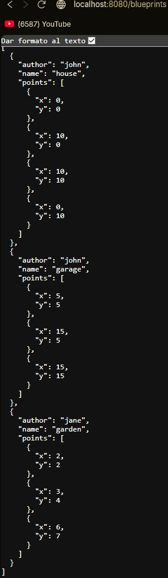

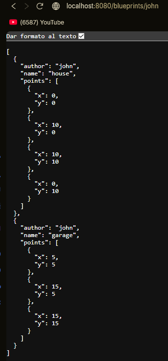

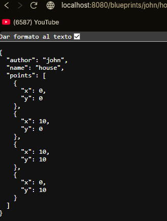

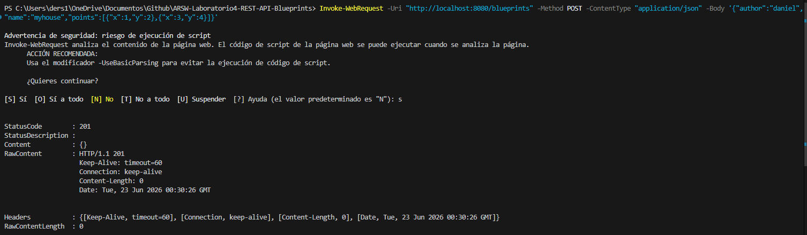

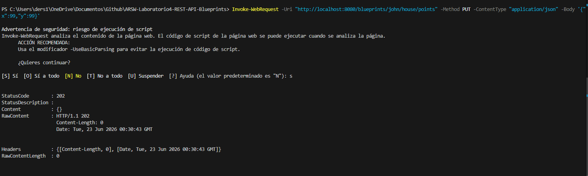

# 2. REST Best Practices

**What was done:**

- The base path of all endpoints was changed from `/blueprints` to **`/api/v1/blueprints`**, following the explicit API versioning convention.
- The generic class `ApiResponse<T>` was created to wrap **all** API responses uniformly, with three fields: `success` (boolean), `message`, and `data`. This avoids the client having to guess the shape of the response depending on the endpoint or the outcome (success/error).
- HTTP status codes were correctly mapped according to the semantics of each operation:
  - `200 OK` for successful queries (`GET`).
  - `201 Created` when creating a new blueprint (`POST`).
  - `202 Accepted` when adding a point to an existing blueprint (`PUT`).
  - `400 Bad Request` when input validation fails (for example, `author` or `name` left blank).
  - `404 Not Found` when the requested blueprint or author does not exist.
  - `409 Conflict` when attempting to create a blueprint that already exists (duplicate author + name).
- An `@ExceptionHandler` for `MethodArgumentNotValidException` was implemented, so that `@Valid` validation errors also respond using the uniform `ApiResponse` format, instead of the generic error message Spring returns by default.

**Adjustments made:**

- When using Swagger alongside the custom `ApiResponse<T>` class, there was a naming collision with Swagger's `@ApiResponse` annotation (`io.swagger.v3.oas.annotations.responses.ApiResponse`). This was resolved by using the fully qualified name (`edu.eci.arsw.blueprints.controllers.ApiResponse`) in the controller, instead of a direct `import`, so both can coexist without ambiguity.

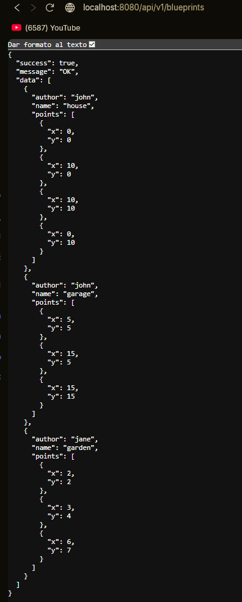

# 3. Swagger/OpenAPI

**What was done:**

- The `springdoc-openapi-starter-webmvc-ui` dependency, already present in the `pom.xml`, was leveraged to generate automatic API documentation.
- The `BlueprintsAPIController` controller was annotated with `@Tag` at the class level, and each endpoint with `@Operation` (describing its purpose) and `@ApiResponses` (documenting the possible response codes and their meaning).
- Interactive documentation became available at `http://localhost:8080/swagger-ui.html`, where all endpoints can be explored and executed directly from the browser, without needing Postman or `curl`.

**Adjustments made:**

- As mentioned in point 2, it was necessary to explicitly distinguish Swagger's `@ApiResponse` annotation from the custom `ApiResponse<T>` class to avoid compilation errors due to name ambiguity.

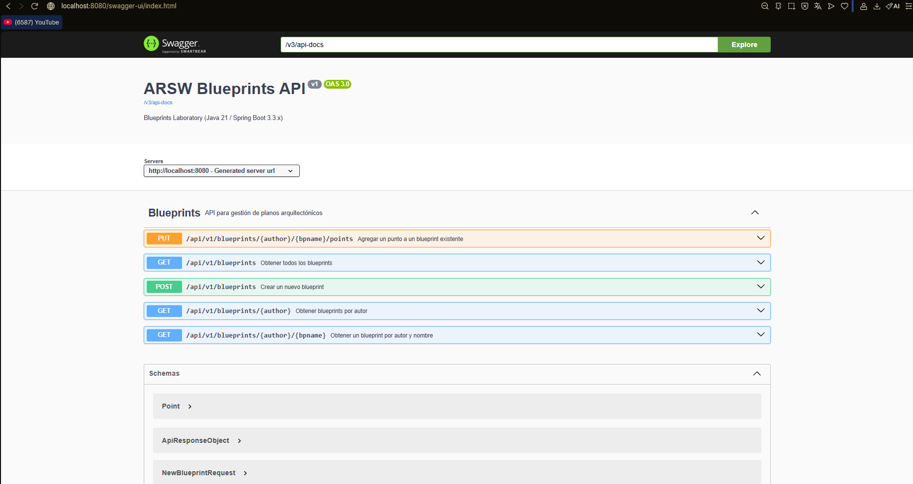

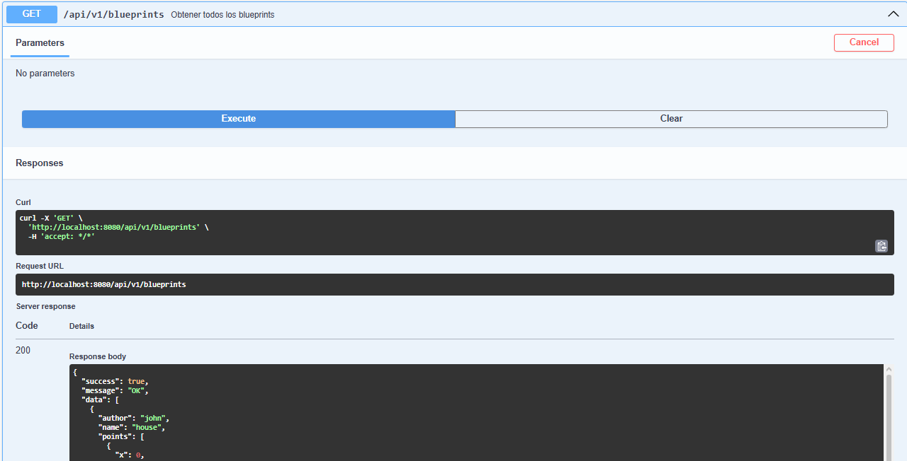

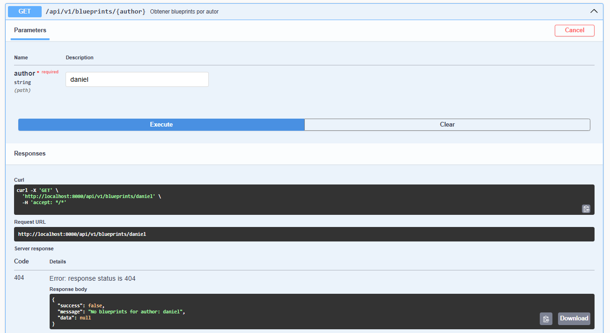

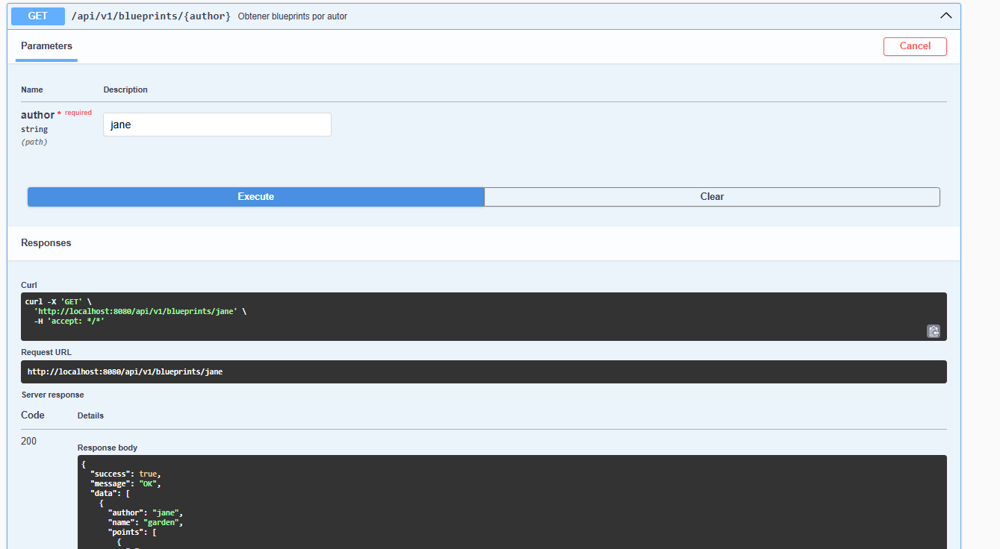


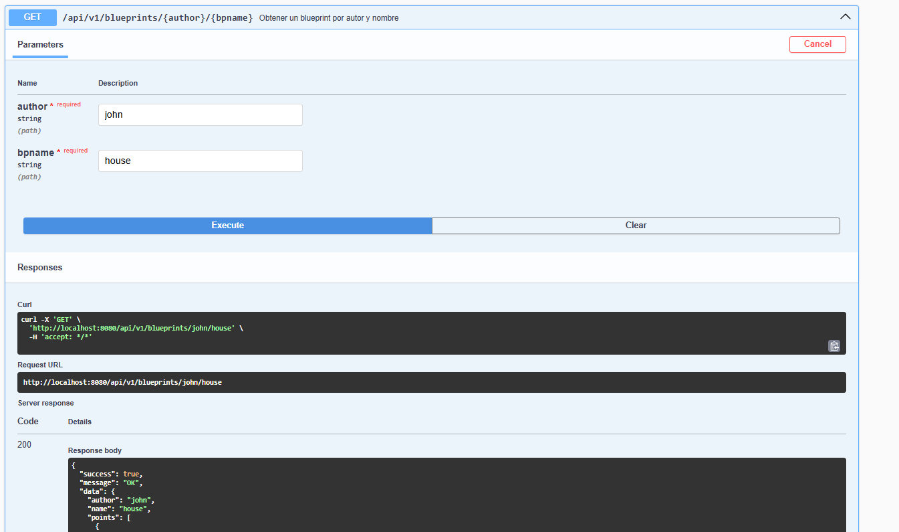

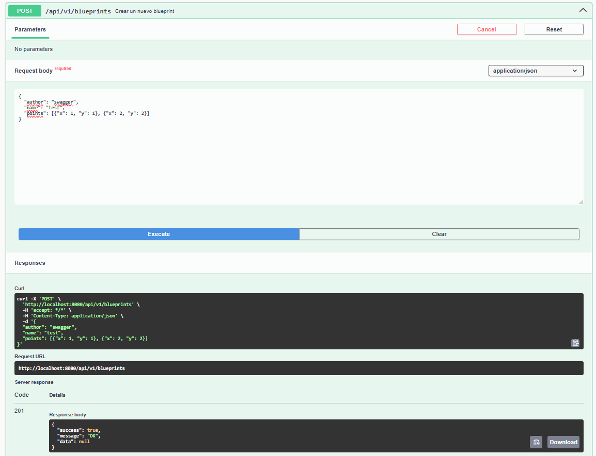

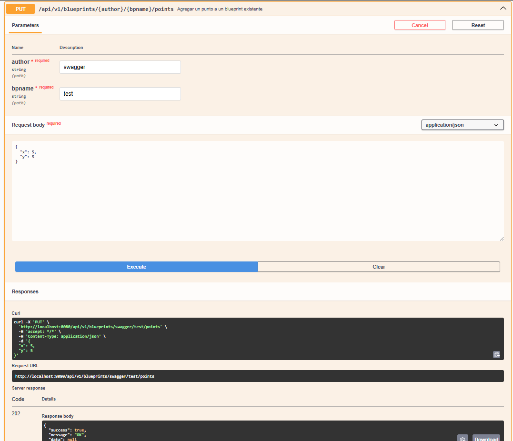

# 4. Filters

**What was done:**

- The point processing filters (`IdentityFilter`, `RedundancyFilter`, `UndersamplingFilter`) were already implemented in the base project, each applying a different transformation to a blueprint's list of points:
  - `IdentityFilter`: does not modify the points, returns them as-is.
  - `RedundancyFilter`: removes consecutive duplicate points.
  - `UndersamplingFilter`: keeps 1 out of every 2 points.
- Each filter is activated through a different Spring profile (`redundancy`, `undersampling`), being injected as the `BlueprintsFilter` implementation consumed by `BlueprintsServices`.

**Adjustments made:**

- A bug was fixed in `IdentityFilter`'s activation condition: it originally lacked a well-defined exclusionary profile condition, which caused dependency injection conflicts whenever one of the other two filters was activated. Its annotation was adjusted to `@Profile("!redundancy & !undersampling")`, so that `IdentityFilter` only activates when no other filter is explicitly enabled, preventing Spring from trying to instantiate more than one `BlueprintsFilter` at the same time.

---

# 5. How to Run the Project

## Prerequisites

- Java 21
- Maven 3.9+
- Docker and Docker Compose (for PostgreSQL and for the integration tests)

## 5.1 Running with in-memory persistence (default)

No database setup required. This uses `InMemoryBlueprintPersistence`.

```bash
mvn clean install
mvn spring-boot:run
```

The API will be available at `http://localhost:8080/api/v1/blueprints`.

## 5.2 Running with PostgreSQL persistence

Start the database container first, then run the app with the `postgres` profile active:

```bash
docker compose up -d
mvn spring-boot:run "-Dspring-boot.run.profiles=postgres"
```

To verify the data directly inside the database container:

```bash
docker exec -it arsw-laboratorio4-rest-api-blueprints-postgres-1 psql -U blueprints -d blueprints -c "SELECT * FROM blueprint_points;"
```

To stop and remove the database container:

```bash
docker compose down
```

## 5.3 Exploring the API with Swagger

With the application running (either profile), open:

- Swagger UI: `http://localhost:8080/swagger-ui.html`
- OpenAPI JSON: `http://localhost:8080/v3/api-docs`

## 5.4 Testing endpoints manually with curl

```bash
curl -s http://localhost:8080/api/v1/blueprints | jq
curl -s http://localhost:8080/api/v1/blueprints/john | jq
curl -s http://localhost:8080/api/v1/blueprints/john/house | jq
curl -i -X POST http://localhost:8080/api/v1/blueprints -H 'Content-Type: application/json' -d '{ "author":"john","name":"kitchen","points":[{"x":1,"y":1},{"x":2,"y":2}] }'
curl -i -X PUT  http://localhost:8080/api/v1/blueprints/john/kitchen/points -H 'Content-Type: application/json' -d '{ "x":3,"y":3 }'
```

## 5.5 Activating point filters

Filters are mutually exclusive and selected via Spring profiles. They can be combined with the `postgres` profile if needed (comma-separated):

```bash
# Default behavior, no transformation
mvn spring-boot:run

# Removes consecutive duplicate points
mvn spring-boot:run "-Dspring-boot.run.profiles=redundancy"

# Keeps 1 out of every 2 points
mvn spring-boot:run "-Dspring-boot.run.profiles=undersampling"

# Example: redundancy filter + Postgres persistence together
mvn spring-boot:run "-Dspring-boot.run.profiles=redundancy,postgres"
```

## 5.6 Running the tests

The project includes unit tests for the persistence layer using Mockito (no real database required):

```bash
mvn test
```

Test reports are generated under `target/surefire-reports/`.